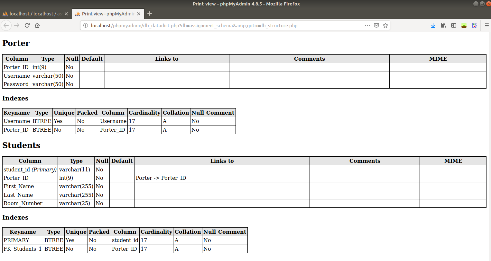

# FEATURES:
* 2 interacting database tables(Porter and Students)
* View, add, edit and delete Student database entries for individual Porters(Users)
* Error checking user authentication that will redirect them to login screen if they are not authorized
* Economic HTML/CSS styling

